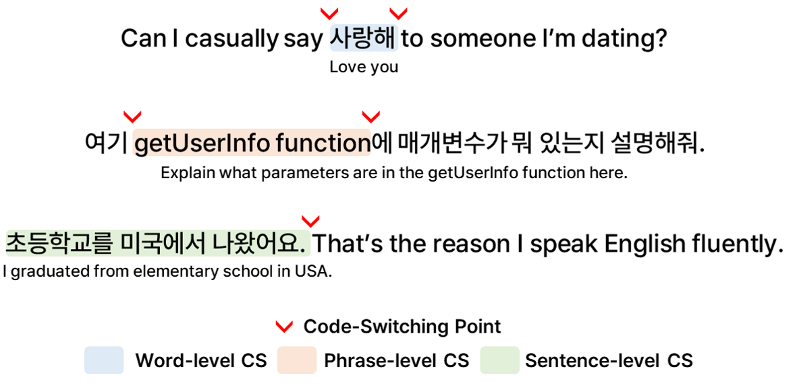

# HiKE: Hierarchical Evaluation Framework for Korean-English Code-Switching Speech Recognition
> [Gio Paik](https://sites.google.com/view/giopaik)\*, [Yongbeom Kim](#), [Soungmin Lee](#), [Sangmin Ahn](https://www.linkedin.com/in/sangmin-ahn-0656ab1b1/)†, and [Chanwoo Kim](https://www.linkedin.com/in/chanwkim)†, *Under Review*    
> \* Corresponding Author, † Equal Contribution

[**✨ Code**](https://github.com/ThetaOne-AI/HiKE) | [**🤗 Dataset**](https://huggingface.co/datasets/thetaone-ai/HiKE) | [**📖 Paper**](https://arxiv.org/abs/2509.24613)

## Introduction
HiKE is the first Korean-English Code-Switching (CS) Automatic Speech Recognition (ASR) benchmark composed of high-quality, natural CS data across various topics. We use **Mixed Error Rate (MER)** and **Point of Interest Error Rate (PIER)** [1] to precisely evaluate the models' CS ASR capability.

Experimental results show that all multilingual ASR models exhibit significantly higher error rates on code-switching data, and that their CS-ASR capabilities can be improved through fine-tuning.

For further details, please refer to [our paper](https://arxiv.org/abs/2509.24613).

[1] Ugan et al., [“PIER: A Novel Metric for Evaluating What Matters in Code-Switching”](https://arxiv.org/abs/2501.09512), ICASSP 2025 

### Hierarchical CS-Level Labels
<p align="center">
  
</p>

To provide more fine-grained comparison of model performance on different forms of code-switching, we labeled each utterance according to the following levels:

- Word-level CS: Code-switching that occurs at the word level, typically as the substitution of a single noun or adjective.
- Phrase-level CS: Occurs when a multi-word phrase within a sentence appears in another language.
- Sentence-level CS: The alternation between languages on a sentence-by-sentence basis.

### Loanword Labels
Loanwords are words adopted from a foreign language and adapted to the phonology and orthography of the new language. For example, the Korean loanword **'버스' [bəs]** and the English word **'bus' [bʌs]** are pronounced almost identically and can be used interchangeably in a CS context. To avoid this problem, we meticulously labeled all loanwords contained in our dataset.

## How To Use
### Install Dependencies
```sh
git clone --recurse-submodules https://github.com/ThetaOne-AI/HiKE
cd HiKE
pip install -r requirements.txt
apt-get update && apt-get install -y ffmpeg  # install ffmpeg if needed
```

### Run Evaluation
```sh
bash scripts/evaluate_whisper.sh
# or
python src/main.py --model whisper --model_name openai/whisper-large --batch_size 8
```

The results will be saved in `./outputs`.

### Evaluate Your Model
- Implement a class that follows the `BaseASR` interface in `src/models/your_model.py`, and register it in `src/main.py`.

Create `src/models/your_model.py`:

```python
from typing import List, Dict, Any
from src.models import BaseASR


class YourModel(BaseASR):
    def __init__(self, model_name: str = "your/model-or-config"):
        self.model_name = model_name
        # TODO: load your model or client here

    def generate(self, input, batch_size: int | None = None, **kwargs) -> List[Dict[str, Any]]:
        if not isinstance(input, list):
            input = [input]
        return [{"text": your_transcribe_fn(x)} for x in input]
```

Register in `src/main.py`:

```python
elif model == "your_model":
    from models.your_model import YourModel
    asr = YourModel(model_name)
```

Run:

```sh
python src/main.py --model your_model --model_name your/model-or-name
```


## Citation

```
@misc{paik2025hike,
      title={{HiKE}: Hierarchical Evaluation Framework for Korean-English Code-Switching Speech Recognition}, 
      author={Gio Paik and Yongbeom Kim and Soungmin Lee and Sangmin Ahn and Chanwoo Kim},
      year={2025},
      eprint={2509.24613},
      archivePrefix={arXiv},
      primaryClass={cs.CL},
      url={https://arxiv.org/abs/2509.24613}, 
}
```
