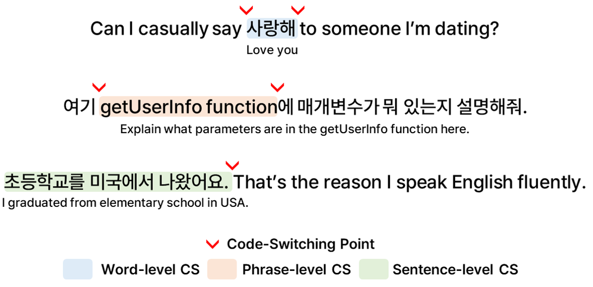

# HiKE: Hierarchical Evaluation Framework for Korean-English Code-Switching Speech Recognition
> [Gio Paik](https://sites.google.com/view/giopaik)\*, [Yongbeom Kim](#), [Soungmin Lee](https://minovermax.github.io/), [Sangmin Ahn](https://www.linkedin.com/in/sangmin-ahn-0656ab1b1/)†, and [Chanwoo Kim](https://www.linkedin.com/in/chanwkim)†, *Under Review*    
> \* Corresponding Author, † Equal Contribution

[**✨ 코드**](https://github.com/ThetaOne-AI/HiKE) | [**🤗 데이터셋**](https://huggingface.co/datasets/thetaone-ai/HiKE) | [**📖 논문**](https://arxiv.org/abs/2509.24613)

## 소개
HiKE는 다양한 주제에 걸친 고품질의 자연스러운 한국어-영어 코드스위칭(Code-Switching, CS) 음성 데이터를 포함한 최초의 CS 자동 음성 인식(ASR) 벤치마크입니다. 모델의 CS-ASR 능력을 정밀하게 평가하기 위해, 평가지표는 **Mixed Error Rate (MER)**과 **Point of Interest Error Rate (PIER)** [1]를 사용합니다.

실험 결과, 모든 다국어 ASR 모델은 코드스위칭 데이터에서 유의미하게 더 높은 오류율을 보였고, 파인튜닝을 통해 CS-ASR 성능을 개선할 수 있음을 확인했습니다.

자세한 내용은 [논문](https://arxiv.org/abs/2509.24613)을 참고하세요.

[1] Ugan 외, [“PIER: A Novel Metric for Evaluating What Matters in Code-Switching”](https://arxiv.org/abs/2501.09512), ICASSP 2025

### 계층적 CS 수준 라벨
<p align="center">
  
</p>

다양한 형태의 코드스위칭에서 모델 성능을 보다 세밀하게 비교하기 위해, 각 발화를 다음과 같은 수준으로 라벨링했습니다:

- 단어 수준 CS: 한 단어(주로 명사 또는 형용사)의 치환 형태로 발생하는 코드스위칭
- 구 수준 CS: 문장 내부의 구(phrase)가 다른 언어로 나타나는 경우
- 문장 수준 CS: 문장 단위로 두 언어가 번갈아가며 나타나는 경우

### 외래어 라벨
외래어는 다른 언어에서 차용되어 새로운 언어의 음운·표기 체계에 맞게 변형된 단어를 의미합니다. 예를 들어, 한국어 외래어 **'버스' [bəs]**와 영어 단어 **'bus' [bʌs]**는 발음이 거의 동일하며 CS 맥락에서 상호 치환되어 사용될 수 있습니다. 이러한 문제를 방지하기 위해, 본 데이터셋에 포함된 모든 외래어를 라벨링했습니다.

## 사용 방법
### 의존성 설치
```sh
git clone --recurse-submodules https://github.com/ThetaOne-AI/HiKE
cd HiKE
pip install -r requirements.txt
apt-get update && apt-get install -y ffmpeg  # 필요 시 ffmpeg 설치
```

### 평가 실행
```sh
bash scripts/evaluate_whisper.sh
# 또는
python src/main.py --model whisper --model_name openai/whisper-large --batch_size 8
```

결과는 `./outputs`에 저장됩니다.

### 사용자 모델 평가
- `src/models/your_model.py`에 `BaseASR` 인터페이스를 따르는 클래스를 구현하고, `src/main.py`에 등록하세요.

`src/models/your_model.py` 생성:

```python
from typing import List, Dict, Any
from src.models import BaseASR


class YourModel(BaseASR):
    def __init__(self, model_name: str = "your/model-or-config"):
        self.model_name = model_name
        # TODO: load your model or client here

    def generate(self, input, batch_size: int | None = None, **kwargs) -> List[Dict[str, Any]]:
        if not isinstance(input, list):
            input = [input]
        return [{"text": your_transcribe_fn(x)} for x in input]
```

`src/main.py`에 등록:

```python
elif model == "your_model":
    from models.your_model import YourModel
    asr = YourModel(model_name)
```

실행:

```sh
python src/main.py --model your_model --model_name your/model-or-name
```

## 인용

```
@misc{paik2025hike,
      title={{HiKE}: Hierarchical Evaluation Framework for Korean-English Code-Switching Speech Recognition}, 
      author={Gio Paik and Yongbeom Kim and Soungmin Lee and Sangmin Ahn and Chanwoo Kim},
      year={2025},
      eprint={2509.24613},
      archivePrefix={arXiv},
      primaryClass={cs.CL},
      url={https://arxiv.org/abs/2509.24613}, 
}
```


